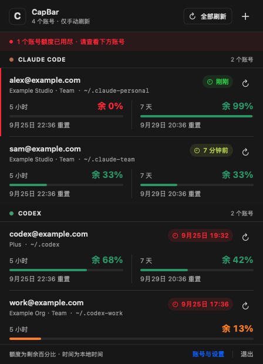
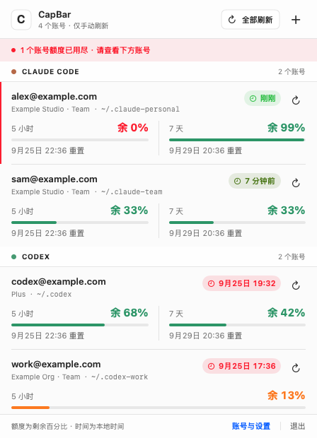
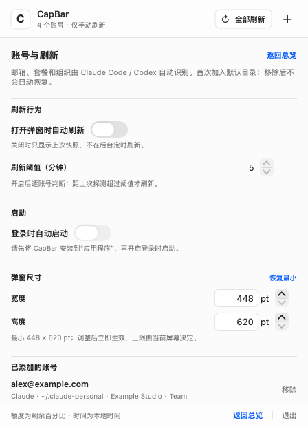

# CapBar

[](../scripts/Info.plist)
[](#安装与使用)
[](../Package.swift)
[](#从源码构建)
[](../LICENSE)

**在 macOS 菜单栏集中查看 Claude Code 与 Codex 额度。** CapBar 把多个本地账号的剩余额度、重置时间和采集时间放在同一个弹窗中。

[English](../README.md) · [简体中文](README-zh.md)

| 深色外观 | 浅色外观 |
| :---: | :---: |
|  |  |

*示意图由 CapBar 本身渲染，使用虚构的 `example.com` 账号，不包含真实账号数据。*

## 功能

- **多账号集中查看：** 添加多个 Claude Code 和 Codex 配置目录；邮箱、套餐和组织等可用信息由服务识别，无需手动给账号命名。
- **额度与时间一目了然：** 分别显示服务提供的 5 小时、7 天窗口及剩余百分比、重置时间、账号快照采集时间。服务未提供的窗口不会凭空显示。
- **按需刷新：** 可以单独刷新账号，也可以刷新全部空闲账号。默认打开弹窗只显示已有快照；可选开启“打开时自动刷新”，按账号判断是否超过共用阈值，默认 5 分钟。
- **状态清楚：** 刷新时显示进度并保留旧额度；失败后继续显示上一次成功快照，同时标记失败。
- **符合 macOS 的交互：** 支持浅色和深色外观、可调整尺寸的弹窗、菜单栏右键菜单，以及可选的登录时启动。

## 安装与使用

需要 **macOS 14 或更高版本**。当前安装包供本机使用，尚未经过 Apple Developer ID 签名与公证，不适合直接分发给其他 Mac。

1. 按[从源码构建](#从源码构建)生成安装包。
2. 打开 `dist/CapBar-0.1.0.pkg`；应用会安装到 `/Applications/CapBar.app`。
3. 从“应用程序”启动 CapBar。它只显示在菜单栏，不显示 Dock 图标。
4. 点击菜单栏图标查看快照；需要最新额度时，手动点“全部刷新”或某个账号旁的刷新按钮。

首次运行会加入存在的 `~/.claude` 和 `~/.codex` 目录。其他配置目录可在设置页添加。右键菜单栏图标可以全部刷新、进入配置、查看关于 CapBar 或退出；弹窗底部也有退出入口。

**登录时启动默认关闭。** 安装到 `/Applications` 后，可以在设置页开启；若 macOS 要求批准，界面会提供打开系统“登录项”设置的入口。`dist/` 中的开发版本不会注册为登录项。登录时启动本身不会探测额度；“打开弹窗时自动刷新”只在打开弹窗时生效。

## 设置



*设置页示意图来自开发预览，因此“登录时自动启动”在图中禁用；正式安装后可操作。*

弹窗默认尺寸为 448 × 620 pt。宽、高可以输入精确数值后提交，也可以用上下按钮每次调整 10 pt；窗口加宽后，账号信息会横向排布。设置和额度快照以 JSON 文件保存在 `~/Library/Application Support/CapBar/`。

## 额度如何刷新

每次刷新 Claude 账号的尝试都会启动一次受限的简短 Claude Code 交互会话，以获取新的 statusline；随后用该配置目录已有的 OAuth 凭据查询 Anthropic 用量接口。任一渠道取得有效额度即可使用；同一额度窗口取采集时间较新的结果。探测可能消耗 Claude 用量，发生重试时消耗可能增加。CapBar 为查询额度读取 macOS 钥匙串中的凭据，但不会把令牌保存在 JSON 文件或日志中。

Codex 使用本机只读 app-server 接口查询，不发送对话。关闭弹窗后，已开始的刷新仍会完成，并按账号保存结果。

## 从源码构建

需要 Swift 6 工具链和 macOS 自带的打包命令行工具。仓库目前为私有仓库，克隆时需要访问权限。

```sh
git clone https://github.com/kikkimo/CapBar.git
cd CapBar
./scripts/package-installer.sh
```

脚本会运行项目检查，构建并验证 `dist/CapBar.app`，生成 `dist/CapBar-0.1.0.pkg`，同时检查安装包固定安装到 `/Applications`，不会定位到开发目录中的旧应用。

```sh
swift run CapBarChecks
./scripts/render-readme-screenshots.sh
```

截图命令使用 SwiftUI 和虚构数据生成 `docs/images/` 中的示意图，不查询真实账号。

## 常见问题

**安装器说成功了，但“应用程序”里没有 CapBar：** 早期安装包可能被 macOS 定位到已有的 `dist/CapBar.app`。请使用修正后的安装包重新安装。安装收据只证明安装流程完成，实际位置应检查 `/Applications/CapBar.app`。

**登录时启动提示需要批准：** 使用 CapBar 设置页的按钮打开 macOS“登录项”设置并允许 CapBar。只有正式安装的应用才能操作这个开关。

## 项目文档

- [视觉设计](../design/capbar-visual-study.html)
- [产品与工程规格](../design/spec.md)
- [实施计划](../design/implementation-plan.md)

## 许可证

CapBar 使用 [MIT 许可证](../LICENSE)。
